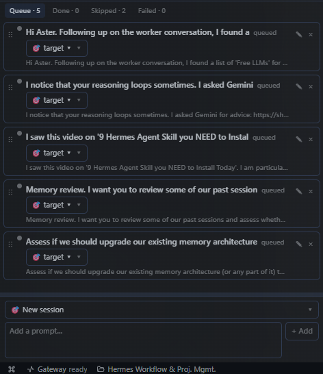

# Prompt Queue — Hermes Desktop plugin



Kanban-style prompt queue for the [Hermes desktop app](https://hermes-agent.nousresearch.com/docs).
Each card is a prompt. Press **▶ Play** and the queue drains strictly top-down:
each card becomes a **real new desktop session** (visible in the sidebar, openable
with the ↗ on the card), runs its prompt, waits for the turn to finish, waits for
any **background self-improvement review** to fully complete (strict gate), then
fires the next card.

Built for feeding a local-model setup a list of prompts one fresh session at a
time — without the next prompt fighting the background review for the inference
slot — while keeping every session visible in the normal sidebar.

## What it adds

- **Pane** — docked below the session list (bottom-left of the default layout);
  drag it anywhere.
- **Cards** — add (textarea, Ctrl/⌘+Enter or **+ Add**), edit (✎), reorder
  (drag ⋮⋮), retry failed (↻), open the card's session (↗). The **×** on a
  card opens a small menu: **↷ Skip** (moves it to the Skipped tab),
  **✓ Mark done** (→ Done), or **✕ Delete** (removes it) — so an accidental ×
  no longer loses a prompt.
- **Queue / Done / Skipped / Failed tabs** — finished cards move off the
  Queue tab so it stays clean (live counts in the labels); Done and Skipped
  have a **✕ clear** button; only the Queue tab is drag-reorderable.
- **Strict review gate** — no new prompt is fired while a background
  memory/skill review is still running (detection: `review.summary` event +
  `thread=bg-review` log markers, 30 s spawn grace, 20 s poll, **fail-closed
  on log errors**: the queue holds with a visible `⏸ holding — review
  verification unavailable` state and retries until absence is confirmed;
  fail-open is an explicit opt-in in the gear).
- **Slot hygiene** — after a card's turn, its one-shot session's
  active-session slot is released (`session.close`; the sidebar row stays), so a
  long queue can't exhaust the session cap.
- **Card targets** — each card can run into a **new session** (default),
  an **existing session** (picker of the latest 10 with a reply, or paste a
  session ID), or a **project** (`📁`): the picker's Project section lists
  the active profile's projects and a **＋ New project…** form (name +
  folder path). A project card always runs in a *fresh* session whose cwd
  is the project's primary path, so the session appears under that project
  in the sidebar; a "new project" card creates it first (idempotently — a
  retry or a second card on the same folder reuses it). Set at add time or
  per-card (`🎯 target ▾`); a queued card can be repointed before it fires.
  Session targets attach via `session.resume` and are **never closed** by
  the plugin (the idle reaper frees their slot, as with any session you
  use); project sessions are one-shots and are closed after their turn.
- **Restart-safe** — queue state persists via plugin storage; a card running
  across an app restart is re-attached (or re-queued, never dropped).
- **`::enqueue{prompt="…"}` transcript directive** — a chat turn can
  *suggest* a card (deduped by a real `dedupeKey` prop). Default is
  **ask-first**: the directive renders a chip showing the suggested prompt
  itself (truncated ~200 chars; full text in the tooltip) that you click to
  accept (the platform contract marks directive attributes as untrusted
  model output); the gear (⚙, pane header) switches it to auto-add.
  Auto-add only fires while the message is still streaming — re-rendering an
  old transcript after a reload never re-queues its directives. Tell your
  agent the directive exists; it won't discover the name on its own.
- **Status bar chip** — right cluster: `queue · N active, M next` /
  `queue paused · M waiting` / `queue idle`.

## State machine

```
queued → launching → running → review-wait → done
              └────────┴─────────┴──┴─────────→ failed (with retry)
```

Per-card watchdogs: 10 s `busyBySession` poll (missed-event fallback),
12 h hard stall → `failed` (session left open, not force-closed). Sized for
local-model turns (observed 1–4 h on this box); real completions come from
`message.complete` + the poll, the stall is only the hung-session tripwire.
If the gateway queues a prompt behind a target's in-flight turn (submit
response `status: "queued"`), the card shows `⏳ queued in target` and
completes on the *drained* turn's completion, not the in-flight one.

## Install

**From the catalog** (once listed in the Nous Hermes plugin catalog):

```bash
hermes plugins install prompt-queue --enable
```

**From this repo** (disk plugin; single ESM `desktop/plugin.js` + `plugin.yaml`, no build step):

1. Clone the repo, then copy the `desktop/` contents into your desktop
   plugins dir — `~/.hermes/desktop-plugins/prompt-queue/desktop/` (or
   `$HERMES_HOME/desktop-plugins/prompt-queue/desktop/` when a profile is
   active). The directory must end in
   `.../prompt-queue/desktop/plugin.js`.
2. The app hot-reloads within seconds. If it doesn't appear: ⌘K →
   **Reload desktop plugins**. A load failure shows a toast naming the error.
3. Manage (enable/disable) in **Settings → Plugins**.

## Requirements

A desktop build recent enough for: `host.request` gateway RPCs
(`session.create`, `session.list`, `session.resume`, `prompt.submit`,
`session.close`, `session.active_list`), `host.openSession`,
`host.onEvent('message.complete')`, `host.state.busyBySession`, `host.logs`,
`ctx.storage`, pane contributions with `dock`, and `TRANSCRIPT_DIRECTIVE_AREA`.
Developed and verified against the 2026-09 build (all of the above confirmed
in `tui_gateway/` + `apps/desktop/src/sdk` source).

## Trust & Autonomy

A card is not a draft — once the engine fires it, it becomes a **full agent
turn** in a real session, with that session's complete tool access
(terminal, files, web, whatever that profile allows). Queue prompts the way
you'd queue autonomous work.

**What the plugin does and doesn't touch:**

- **No network calls.** It never fetches or sends anything beyond the
  Hermes gateway RPCs listed in Requirements (same machine, same gateway).
- **No credential access.** It reads no keys, tokens, or profile data.
- **Log tail for the review gate.** It reads the last 1000 lines of
  `agent.log` (filtered for `bg-review` markers) to know when a background
  review is running. That log is your own, but it can contain content from
  *other* sessions; the gate parses timestamps and markers only — nothing is
  stored or displayed.

**Card sources and their trust level:**

| Source | Trust | Behavior |
|---|---|---|
| Textarea / picker (you typed it) | user-approved | added directly; runs only while Play is active |
| `::enqueue{prompt="…"}` (a chat turn wrote it) | **untrusted model output** — the platform contract for transcript directives is that attributes are untrusted model output | default **ask-first**: renders a clickable chip; the card is added only when you click it (gear → *Suggested prompts: Auto-add* restores immediate add). Either way it runs only while Play is active |

The `::enqueue` path is the one a prompt injection could exploit: a
model-generated (or model-relayed, e.g. quoted from a web page or file)
directive can *suggest* a card you never typed yourself. By default it
**cannot** add one on its own — the chip waits for your click — and the gear
(⚙, pane header) is where that decision lives.

**Review gate semantics.** The gate holds the queue while a background
self-improvement review is running. If the log check itself fails (a
transient `host.logs` blip), the gate **fails closed by default**: the card
shows `⏸ holding — review verification unavailable` and the 20 s re-poll
retries until absence is confirmed. Fail-open is an explicit opt-in
(gear → *Review gate on error: Open*).

## Performance notes (local models)

Each card's default target is a **new session**. On local-model setups,
creating or switching sessions can mean (re)loading KV-cache context for the
session — a compute cost that grows with context length, and it's why a
frequent pattern here is fewer, longer sessions rather than many short ones.
Practical guidance:

- **One-shot, independent prompts** — the default (new session per card) is
  fine and keeps each run isolated.
- **Iterative work on the same topic** — point the cards at **one existing
  session** (🎯 target) so follow-ups reuse that session's context instead of
  paying a fresh load per card.
- Keep each prompt **self-contained**: a card in a new session has no memory
  of the other cards.

## Known limitations

- The engine never submits into a mid-turn session (one card at a time — the
  global gate also holds target cards whose session is mid-turn), but a card
  whose turn stalls >12 h fails with the session left running rather than
  force-closing it.
- Reorder only applies to non-live cards (a live card is mid-flight).
- The review gate is global (one review can run app-wide), matching the
  harness: a review spawned by *any* session gates the next card.
- One-prompt sessions never trigger their *own* background review (the nudge
  counters are per-session) — the gate covers reviews from any session, which
  is the inference-slot protection that matters.

## License

[MIT](./LICENSE)